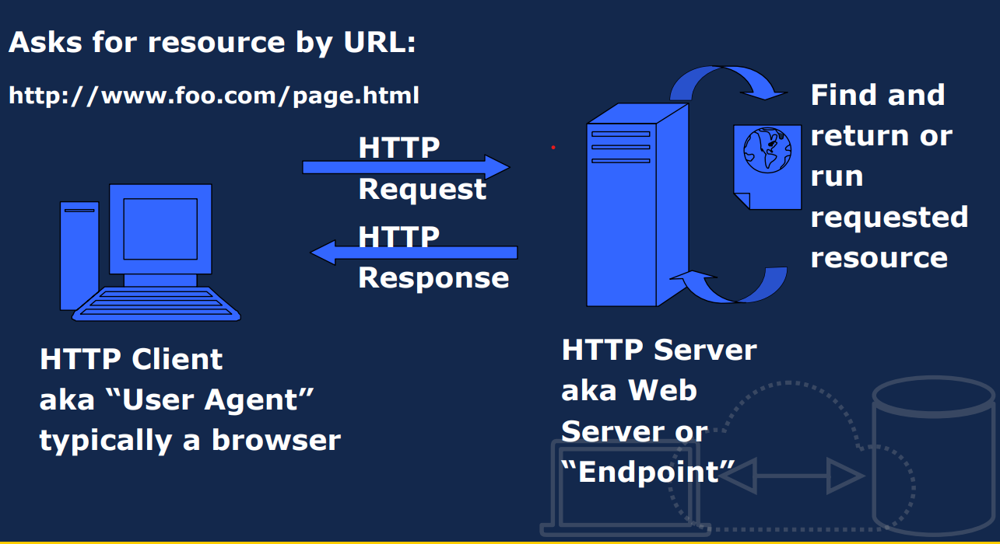
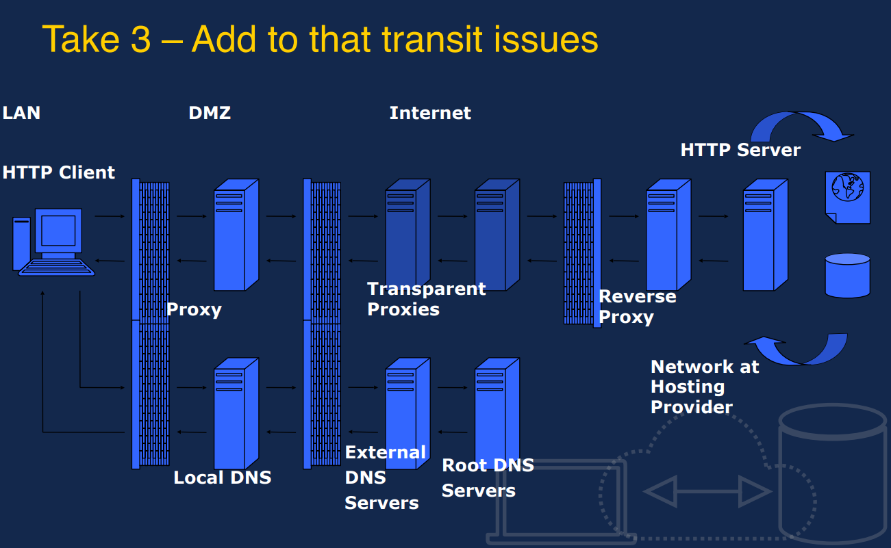

# HTTP Notes
Some review on HTTP by Stella Zhang | 6/28/2022

## Acknowledgement
The content of the notes was derived from the **CSE 135** course slides taught by *Professor Thomas Powell* at UC San Diego CSE Department. 

For questions I came across, I also consulted my mentor *Camdyn Rasque*.
## HTTP Basics
### HTTP (Hyper Text Transfer Protocol)

- It's an *application layer protocols* similar to SMTP, IMAP, NNTP, FTP, etc.
- Simple protocol that defines the standard way that clients request data from Web servers and how these server respond
- Typically it is running on top of TCP/IP

### Three versions initially were used with 1.1 commonly used today
- RFC 1945 HTTP 1.0 (1996)
- RFC 2616 HTTP 1.1 (1999)
 

### Modern HTTP/2 and other variants exist and tunnel the HTTP 1.1 across a form within and SSL stream. 
For developers the HTTP 1.1 mastery is paramount before moving on.
 

### HTTP and TCP/IP
HTTP sits atop the TCP/IP Protocol Stack
- Application Layer: HTTP
- Transport Layer: TCP
- Network Layer: IP
- Data Link Layer: Network Interface

### HTTP: Lower Layers Affect Upper Layers
- Example: Web pages often are composed of many small individual objects. Given HTTPs individual request combined with TCP effects performance can suffer.

- HTTP 1.1 and various dev best practices like bundling, domain sharding, etc. employed to address poor performance.

- Yet today with HTTP/2 we may find these best practices may actually become anti-patterns!

- **Takeaway:** The network and HTTP matter. How you build your website or app has a significant material effect on performance and eventually end user happiness. Get performance right or pay a user engagement price!

### Basic HTTP Request/Response Cycle
Ask for resources by URL, and here we will proceed by:
- The HTTP Client, a browser, usually **request** through an URL
- THe HTTP Server, Web Server or End point, usually **response** by finding an returning or runing the requested resource.

### The server side operation
- First there is a firewall between the Client and server, 
- And the Web server will 

### Add to that transit issues

**Reflection**: A relatively straightforward project. Trivial once one gets used to how channels work.

 

