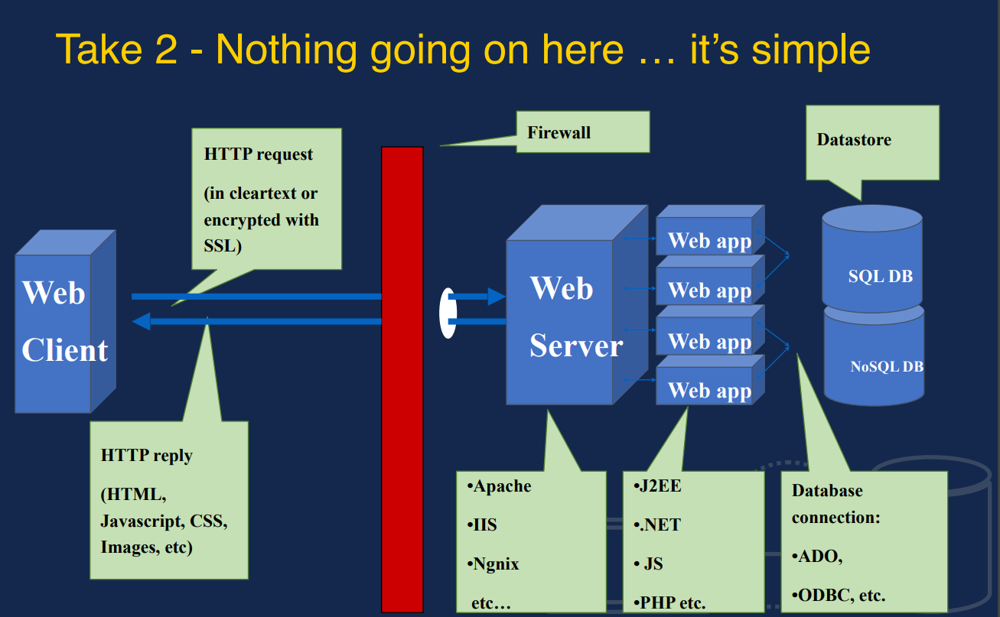
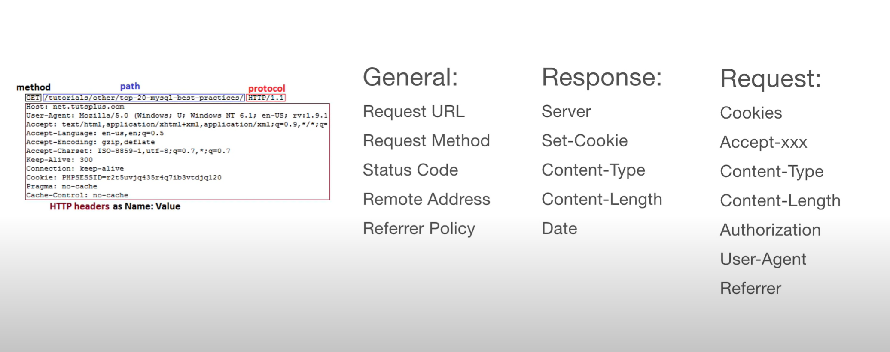
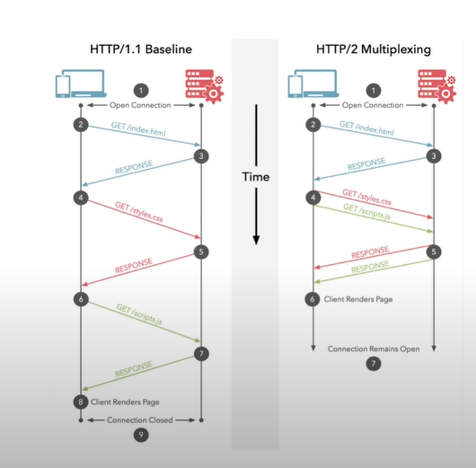
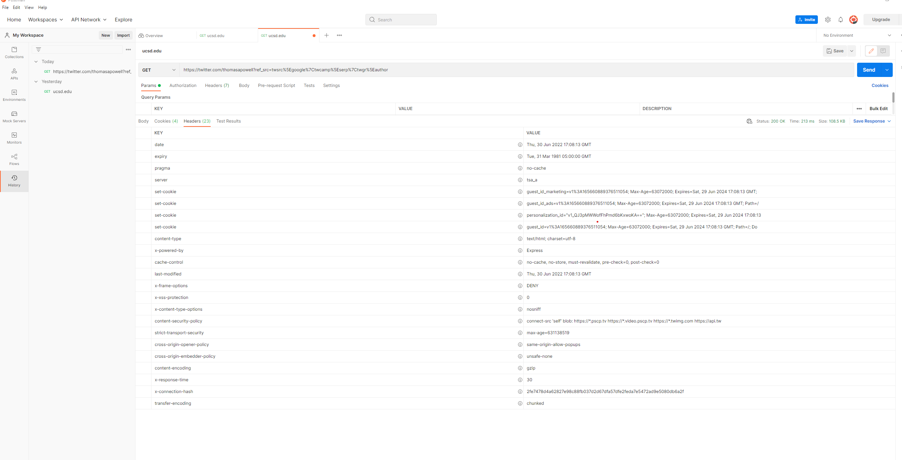
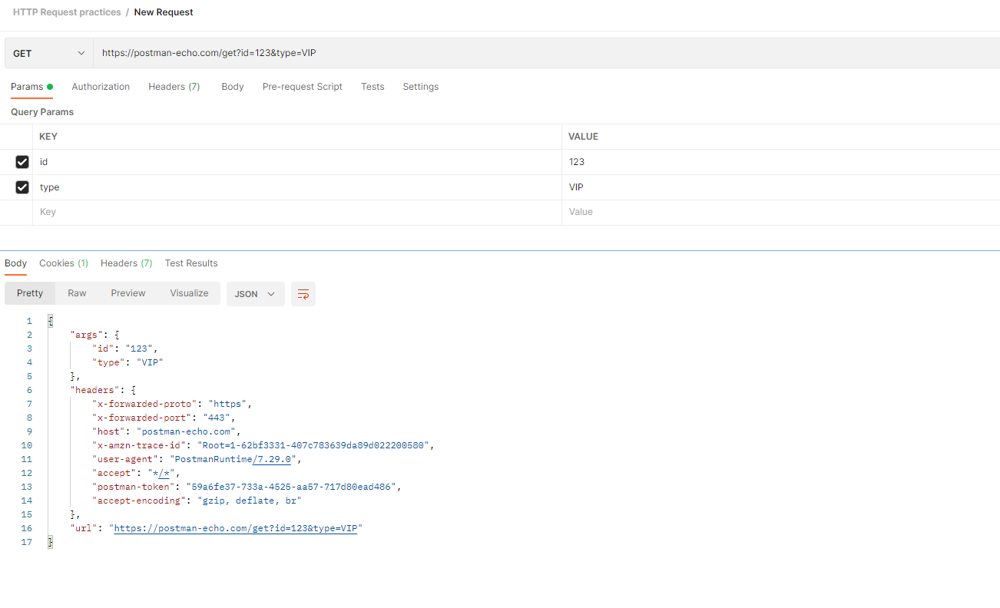
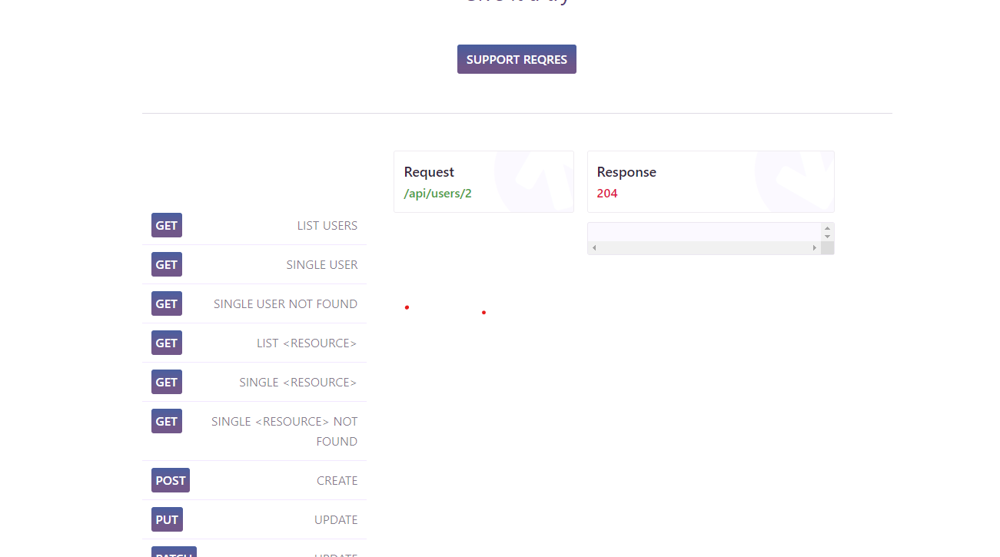
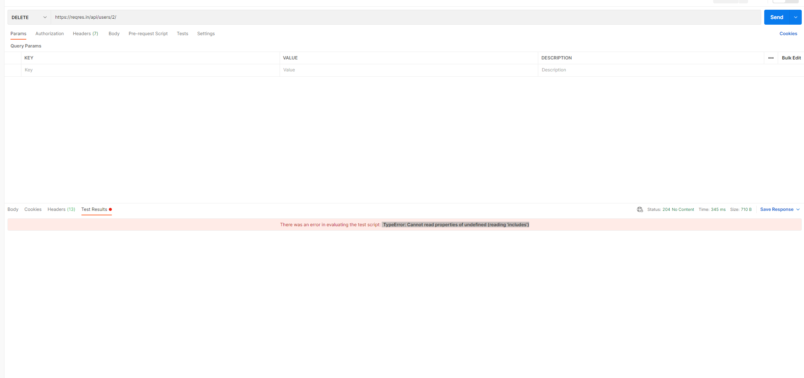

# HTTP Notes
Some review on HTTP by Stella Zhang | 6/28/2022

## Acknowledgement
The content of the notes was derived from the **CSE 135** course slides taught by *Professor Thomas Powell* at UC San Diego CSE Department. 

**Other References:**  
Modzilla, [Postman Learning doc](https://learning.postman.com/docs/sending-requests/requests/), YouTube Channel of Valentin Despa, codebubb, 

For questions I came across, I also consulted my mentor *Camdyn Rasque*.
## HTTP Basics
### HTTP (Hyper Text Transfer Protocol)

> Communcation between web servers and clients

- It's an *application layer protocols* similar to SMTP, IMAP, NNTP, FTP, etc.
- Simple protocol that defines the standard way that clients request data from Web servers and how these server respond
- Typically it is running on top of TCP/IP

### Three versions initially were used with 1.1 commonly used today
- RFC 1945 HTTP 1.0 (1996)
- RFC 2616 HTTP 1.1 (1999)

### Modern HTTP/2 and other variants exist and tunnel the HTTP 1.1 across a form within and SSL stream. 
For developers the HTTP 1.1 mastery is paramount before moving on.
 

### HTTP and TCP/IP
HTTP sits atop the TCP/IP Protocol Stack
- Application Layer: HTTP
- Transport Layer: TCP
- Network Layer: IP
- Data Link Layer: Network Interface

### HTTP: Lower Layers Affect Upper Layers
- Example: Web pages often are composed of many small individual objects. Given HTTPs individual request combined with TCP effects performance can suffer.

- HTTP 1.1 and various dev best practices like bundling, domain sharding, etc. employed to address poor performance.

- Yet today with HTTP/2 we may find these best practices may actually become anti-patterns!

- **Takeaway:** The network and HTTP matter. How you build your website or app has a significant material effect on performance and eventually end user happiness. Get performance right or pay a user engagement price!

### Basic HTTP Request/Response Cycle
Ask for resources by URL, and here we will proceed by:
- The HTTP Client, a browser, usually **request** through an URL
- THe HTTP Server, Web Server or End point, usually **response** by finding an returning or runing the requested resource.

### The server side operation
- First there is a firewall between the Client and server, 
- And the Web server will 

### Add to that transit issues

## Mind your proxies
<ul>
  <li>Proxies are HTTP Intermediaries</li>
   <ul>
      <li>All act as both clients and servers</li>
      <li>Friend and foe to Web devs and you should acklowledge them</li>
    </ul>
  <li>Major types of proxies can be distinguished by where they live and how they get traffic
  </li>
  <ul>
    <li>Explicit</li>
    <li>Transparent/Intercepting</li>
    <li>Reverse/Surrogate</li>
  </ul>
  <li>Three primary uses for proxies
    <ul>
      <li>1. Security</li>
      <li>2. Performance</li>
      <li>3. Content Filtering</li>
    </ul>
  </li>
</ul>

## HTTPS 
> - Hyper Text Transfer Protocol Secure
> - Data sent is encrypted
> - SSL/TLS
> - Install certificate on web host

## HTTP Requests
> Every request is completely independent
> - Similar to transactions
> - Programming, Local Storage, Cookies, Sessions are used to create enhanced user experiences.

### HTTP Methods: 
> - GET: Retrieves data from the server
> - POST: Submit data to the server
> - PUT: Update data already on the server
> - DELETE: Deletes data from the server
> - PATCH: update some existing data fields

For example, if you're working with an API for a To Do list application, you might use a **GET** method to retrieve the current list of tasks, a **POST** method to create a new task, and a **PUT** or **PATCH** method to edit an existing task.
### Difference between PUT and POST request:

The HTTP PUT request method creates a new resource or replaces a representation of the target resource with the request payload.

The  **difference** between PUT and POST is that PUT is idempotent: calling it once or several times successively has the same effect (that is no side effect), whereas successive identical POST requests may have additional effects, akin to placing an order several times.

HTTP Header Fields

### HTTP Status Codes:
> - 1xx: Informational : Request received/processing
> - 2xx: Sucess: Successfully Recieved, understood and acceppted
> - 3xx: Redirect: Further action must be taken/redirect
> - 4xx: Client Error: Request does not have what it needs
> - 5xx: Server Error: Server failed to fulfill an apparent valid request

> - 200 -OK
> - 201 - ok CREATED
> - 301 - Moved to new URL
> - 304 - Not modified (Cached version)
> - 400 - Bad Request
> - 401 - Unauthorized
> - 404 - Not found
> - 500 - Internal server error

### HTTP/2
Respond with more data; Reduce latency by enabling full request and response multiplexing; Fast, efficient and secure.

## The Law of Three Redux
- Consider the form of HTTP Requests and responses, there are three pieces to each
- As a server-side program you understand you can only get data from the three pieces of request (so consider thosse your input and watch them carefully)
- Furthermore you can only output via the three pieces of the response (mostly the message body)
- This is it, there is nothing more to the bedrock of the web transmit wise (save addressing statefulness)

## A closer Look at the Request Line

Consist of three major parts:

The Request Method followed by a space

Methods in HTTP 1.1 include: GET, POST, HEAD, TRACE, OPTIONS, PUT, DELETE and CONNECT
- GET, POST, and HEAD are the most common
- Extension methods such as those specified by WebDav (RFC 2518)

The request URI followed by a space
- The URL associated with the resource to be fetched or acted upon

- The HTTP Version followed by the CRLF

GET Y* Y Fetch data from the specfied URI. Data mayb e passed via a query string GET requests shall only retrieve data, not change state. Naybe used in an HTNL fom,
## Jargon time!

An HTTP method is considered safe if it doesn't change the state of the endpoint (Server, app, etc.)
- A read style method (GET, HEAD OPTIONS, etc) would be considered SAFE.

An HTTP method is considered **indempotent** if it can be repeated with the same effect and the server stays in the same state
- GET would be indempotent but other less obvious methods like DELETE are idempotent because once deleted something can be repeat, DELETE and nothing really changes.
- A POST o nthe other hand would be not indempotent because something is created each line.
- SAFE methods are idempotent ,but idempotent methods don't have to be safe.
## Making a simple HTTP request
- Use a command line tool like "curl" to make a request
> curl https://ucsd.edu I more

## The HTTP Response 
Response status line consists of 3 parts:    
1. The HTTP Version followed by a space
2. Status Code Followed by a SP.

## Project 1
Install the application Postman. 

In some directory install the npm package JSON Server (locally, not globally, don’t use -g)

Get JSON server up and running

Try to do the following to your JSON server using only your Postman application

- Make an HTTP request that retrieves all records
- Make an HTTP request that receives just one of those records
- Make an HTTP request that updates one of those records
- Make an HTTP request that creates a brand new record
- Make an HTTP request that deletes one of those records

> What is this pattern called? Why might this pattern be useful? (write this down in your notes somewhere)

> Scavenger hunt time. Find as many headers as you can in the wild using your DevTools and random websites

> If you come across a header that you know and understand, write down what you think it is and its purpose

> If you come across a header that you’re unfamiliar with, look up what its purpose is and write that down in your notes.
## Brief view and Purpose of the practice projects:
Postman is an HTML client. 

We can send requests in Postman to connect to APIs that we are working with. 

> Our requests can retrieve, add, delete, and update data. Whether we are building or testing our own API, or integrating with a third-party API, we can send our requests in Postman. 

> Our requests can send parameters, authorization details, and any body data we require.

#### For instance, if you're building a client application (such as a mobile or web app) for a store, you might send a request to retrieve the list of available products, another request to create a new order (including the selected product details), and a different request to log a customer in to their account.

> When we send a request, Postman displays the response received from the API server in a way that lets you examine, visualize, and if necessary troubleshoot it.

## Make an HTTP Request that Retrieves all the records:
### GET all the headers from Thomas's Twitter Page
HTTP headers let the client and the server pass additional information with an HTTP request or response. An HTTP header consists of its case-insensitive name followed by a colon (:), then by its value. Whitespace before the value is ignored.

For instance, I made a GET request on Thomas's Twitter main page. Here are several headers:

**What actually happened during the process?**

In this example, Postman is acting as the client application and is communicating with an API server. Here's what happened when you selected Send:

- Postman sent a GET request to the Postman Echo API server located at postman-echo.com.
- The API server received the request, processed it, and returned a response to Postman.
- Postman received the response and displayed it in the Response pane.

## Make an HTTP requests with details that I need
We can specify the details you need for your request.

## Made a POST request to JSON server to create some brand new records:
You will need to send body data with requests whenever you need to add or update structured data. For example, if you're sending a request to add a new customer to a database, you might include the customer details in JSON. Typically you will use body data with PUT, POST, and PATCH requests.

The Body tab in Postman allows you to specify the data you need to send with a request. You can send various different types of body data to suit your API.

## Make an HTTP request that receives just one of those records
We can specify the details you need for your request.

## Make an HTTP request that updates one of those records

PATCH — update some existing data fields
PUT - 

## Make an HTTP request that deletes one of those records
On reqres.in:

When we sent the delete request to  https://reqres.in/api/users/2/, we will receive a status code of 204 No Content as a test result that is supposed to be:

Howvever, I'm also receiving an error " TypeError: Cannot read properties of undefined (reading 'includes')"

## Notes: 
> Postman is an HTML Client.

> Network tab in inspect is really important tool to use for reference.

> If you're building an API, the URL will typically be the base location plus path. 
- For example, in the request https://postman-echo.com/get, https://postman-echo.com is the base URL, and /get is the endpoint path.
- If you're using a third-party API, your API provider will supply the URLs you need, for example within their developer documentation.

**Reflection**: I had several 

 

